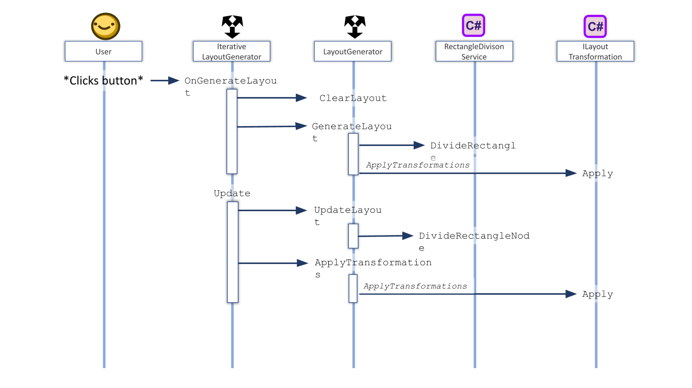

Super Simple Random Map Generator
=================================

The goal of this project is to create a number of demos which show how to randomly a somewhat interesting map in Unity.

Technical notes
---------------

At the core of the map generation is a simple algorithm which divides a given rectangle recursively into smaller rectangles. The generated
layout of random rectangles provides a easy to work with datastructure(s) such as a node graph where each node has a rectangle and 0 or
more neighbour nodes or a (axis aligned) BSP (the latter is not implemented currently). 

In the current application the division algorithm is implemented in the ```RectangleDivisionService.cs``` class. This class is exposed to the editor
via a MonoBehaviour called ```LayoutGenerator.cs```. To demonstrate the division algorithm in action another MonoBehaviour called  
```IterativeLayoutGenerator.cs``` which controls the LayoutGenerator to incrementally (ie iteratively) generate the map. This way the user can 
see the map being generated in real-time.

After the layout is generated a number of transformations can be applied to change, cull, replace or populate the rectangles depending on the need of
the application. The transformations implement ```ILayoutTransformation``` interface and override a ```ScriptableObject```. The latter is just a 
practical convention. The scriptable transformations can be added to the LaypoutGenerator's Transformation array. As this system is still being developed 
the details can best be derived from looking at examples found in ```Assets/SciptableObjects```.


<center>
    image 1. Flow diagram of the layout generation
</center>

